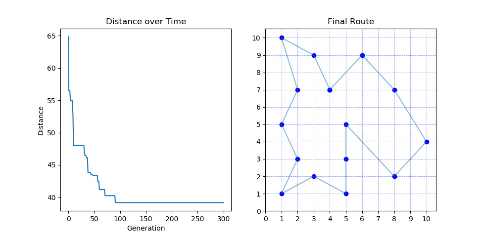

# Traveling Salesman Problem via Evolutionary Algorithm

For the given set of cities in XY coordinates program tires to find solution to travelling salesman problem  
with the use of genetic algortithm.

### Prerequisites

Program written in Python (Version 3.7.1) as a PyCharm project.

Packages required:  
-> matplotlib  
-> numpy

### Run

As for the current version, there is only one file to be ran - tsp-base.py.  
Running the script will automatically calculate the solution to default problem.  

## Customization

There are five arguments of the main fuction that can be modified.

```
genetic_algorithm_tsp(cities, pop_size, elite_size, mutation_rate, generations)
```

cities - Represents the list of City objects that store X and Y coordinates.  
pop_size - Represents the number of individuals in population.  
elite_size - Represents the number of best fit individuals that always pass through to next generation.  
generations - Represents the number of generations to be ran.  
mutation_rate - Represents the probability of chromosome (path) mutation.  

Program by default has an exmemplary list of cities already implemented.

```
cityList = [City(x=1, y=1), City(x=1, y=5), City(x=1, y=10), City(x=2, y=3), City(x=2, y=7), City(x=3, y=2),
            City(x=3, y=9), City(x=4, y=7), City(x=5, y=1), City(x=5, y=3), City(x=5, y=5), City(x=6, y=9),
            City(x=8, y=2), City(x=8, y=7), City(x=10, y=4)]
```

It can be modified freely, depending on user needs.

## Results 

After last generation is calculated program displays the graphs of Distance of the best route vs generation and final best route. Graphs below present output for given set of initial parameters:
```
pop_size = 200
elite_size = 40
generations = 300
mutation_rate = 0.1
```


After each generation is calculated, length of the best path is displayed in the console.  
When program reaches it's end, final path is being displayed aswell.  

```
(...)
Iteration 297: 39.14822683948874
Iteration 298: 39.14822683948874
Iteration 299: 39.14822683948874
[(4,7), (6,9), (8,7), (10,4), (8,2), (5,5), (5,3), (5,1), (3,2), (1,1), (2,3), (1,5), (2,7), (1,10), (3,9)]
```

